# Media Processing Web App

A Flask-based web application for processing and analyzing Text, Images, Video, and Audio. This project demonstrates various media processing techniques using Python libraries like OpenCV, Librosa, and MoviePy.

## Features

### 1. Text Processing
- **Encoding**: Convert text to ASCII, Binary, and Hexadecimal representations.

### 2. Image Processing
- **Channel Decomposition**: Split an image into Red, Green, and Blue channels.
- **Sampling**: Reduce image resolution to simulate pixelation.
- **Quantization**: Reduce color depth and visualize pixel intensity in 2D grids and 3D plots.
- **Color Mixing**: Mix RGB colors into specific regions of an image.

### 3. Video Processing
- **Frame Extraction**: Extract frames from a video at specific intervals.
- **Metadata**: Retrieve video duration, FPS, and resolution.

### 4. Audio Processing
- **Waveform Visualization**: Generate and display the audio waveform.
- **Binary Representation**: Convert audio samples to binary format (PCM).

## Installation

### Prerequisites
- Python 3.9+
- pip (Python package manager)

### Local Setup

1. **Clone the repository** (if applicable) or navigate to the project directory.

2. **Create a virtual environment (optional but recommended):**
   ```bash
   python -m venv venv
   # Windows
   venv\Scripts\activate
   # macOS/Linux
   source venv/bin/activate
   ```

3. **Install dependencies:**
   ```bash
   pip install -r requirements.txt
   ```

4. **Run the application:**
   ```bash
   python app.py
   ```
   The app will be accessible at `http://127.0.0.1:5000`.

## Docker Usage

This project includes a `Dockerfile` for easy containerization.

1. **Build the Docker image:**
   ```bash
   docker build -t media-app .
   ```

2. **Run the container:**
   ```bash
   docker run -p 5000:5000 media-app
   ```

3. **Access the application:**
   Open your browser and navigate to `http://localhost:5000`.

## Project Structure

```
Projectv2/
├── app.py              # Main Flask application
├── Dockerfile          # Docker configuration
├── requirements.txt    # Python dependencies
├── README.md           # Project documentation
├── static/             # Static assets (CSS, JS, processed files)
│   ├── uploads/        # User uploaded files
│   └── processed/      # Generated files (plots, frames, etc.)
└── templates/          # HTML templates
    ├── index.html
    ├── text.html
    ├── image.html
    ├── video.html
    ├── audio.html
    └── layout.html (implied)
```

## Technologies Used

- **Flask**: Web framework for Python.
- **OpenCV**: Computer vision library for image processing.
- **Pillow (PIL)**: Python Imaging Library for image manipulation.
- **Librosa**: Audio analysis and music information retrieval.
- **MoviePy**: Video editing and processing.
- **Matplotlib**: Plotting library for visualizations.

## Screenshots

### 🏠 الصفحة الرئيسية (Home Page)

الصفحة الرئيسية للتطبيق تعرض الأقسام الأربعة الرئيسية: تشفير النصوص، تمثيل الصور، معالجة الفيديو، وتحليل الصوت. كل قسم يحتوي على أيقونة ووصف مختصر للوظائف المتاحة.

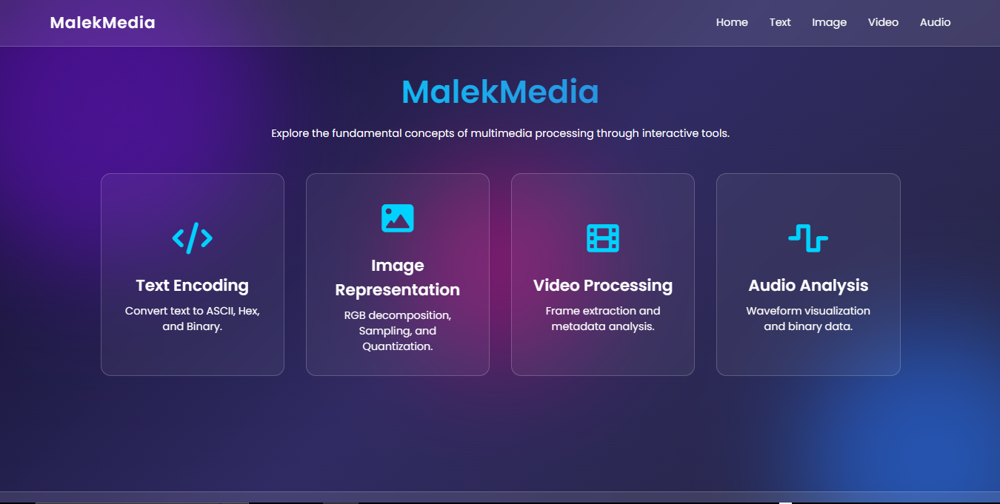

---

### 📝 واجهة تشفير النصوص (Text Encoding)

#### واجهة الإدخال
واجهة تشفير النصوص حيث يمكن للمستخدم إدخال أي نص وتحويله إلى تمثيلات مختلفة (ASCII, Hexadecimal, Binary) بالضغط على زر "Convert".

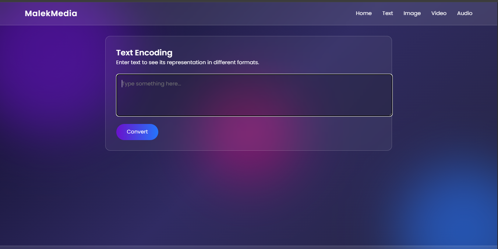

#### نتائج التشفير
جدول النتائج يعرض كل حرف من النص المُدخل مع تمثيله بصيغة ASCII (عشري)، Hexadecimal (ست عشري)، و Binary (ثنائي).

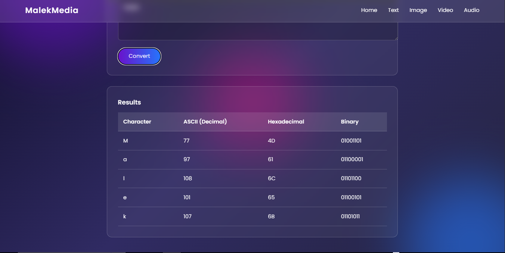

---

### 🖼️ واجهة تمثيل الصور (Image Representation)

#### تبويب قنوات RGB (RGB Channels)
واجهة تمثيل الصور مع تبويب "RGB Channels" المفعّل. يمكن للمستخدم رفع صورة واستكشاف طبقات الألوان RGB، أخذ العينات (Sampling)، والتكميم (Quantization).

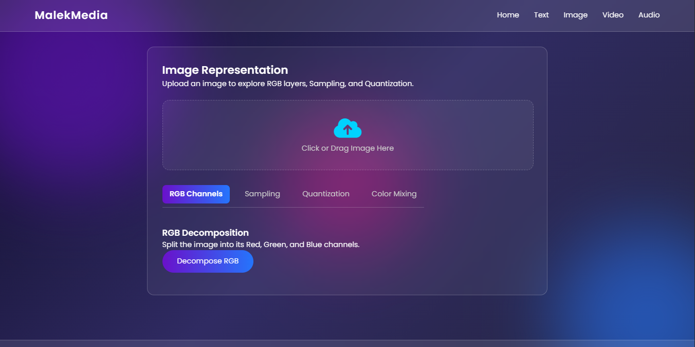

#### نتيجة تحليل قنوات RGB
نتيجة عملية تفكيك الصورة إلى قنوات الألوان الثلاث (الأحمر، الأخضر، الأزرق) مع إمكانية تشغيل الرسوم المتحركة للطبقات باستخدام زر "Animate Layers".

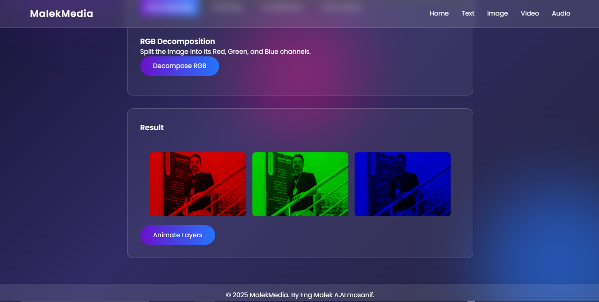

#### تبويب أخذ العينات (Sampling)
واجهة أخذ العينات لتقليل الدقة المكانية للصورة (Pixelation). يمكن للمستخدم تحديد عدد الصفوف والأعمدة لمحاكاة تقليل الدقة.

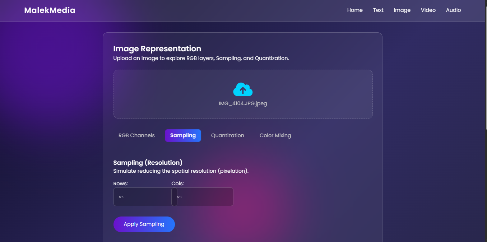

#### نتيجة التكميم - تمثيل الشبكة (Quantization Grid)
عرض شبكة ثنائية الأبعاد لقيم بكسلات الصورة بعد عملية التكميم، حيث يظهر كل بكسل بقيمته الرقمية مع تدرج لوني.

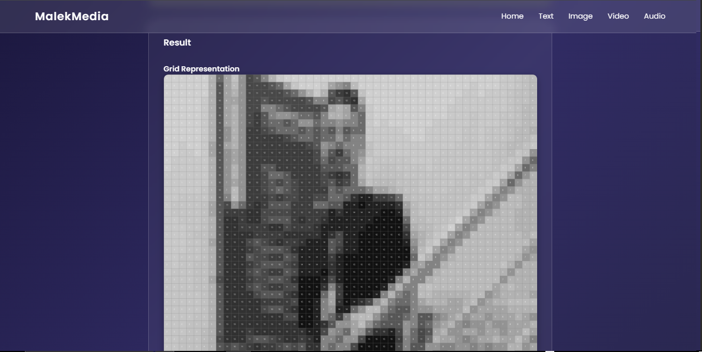

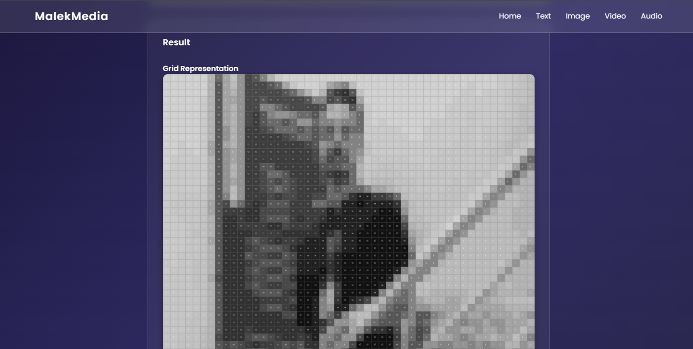

#### التصور ثلاثي الأبعاد للتكميم (3D Quantization)
رسم بياني ثلاثي الأبعاد يعرض توزيع شدة البكسلات في الصورة عند 256 مستوى تكميم، مما يوفر تصوراً بصرياً متقدماً لبيانات الصورة.

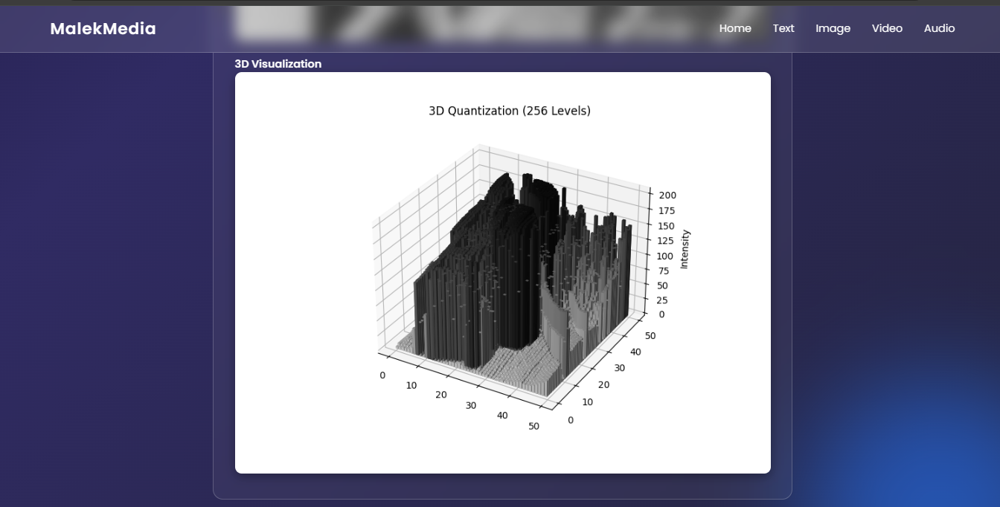

#### تبويب مزج الألوان (Color Mixing)
واجهة مزج الألوان حيث يمكن للمستخدم اختيار منطقة من الصورة ومزج ألوان RGB فيها باستخدام أشرطة التمرير أو أداة اختيار الألوان.

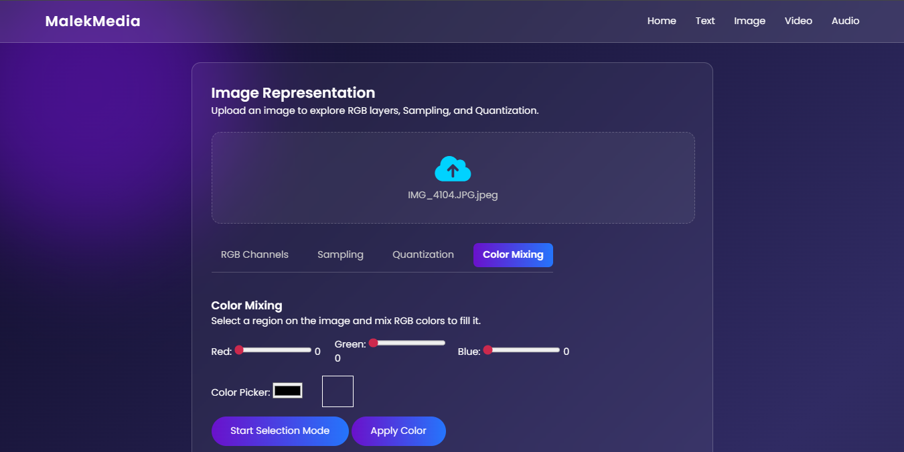

#### أداة اختيار الألوان (Color Picker)
نافذة اختيار الألوان المنبثقة التي تتيح للمستخدم اختيار لون بدقة باستخدام لوحة الألوان مع إمكانية إدخال قيم RGB يدوياً.

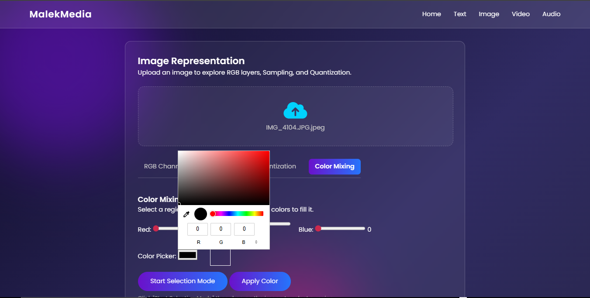

#### نتيجة مزج الألوان
نتيجة عملية مزج الألوان على الصورة، حيث تم تطبيق اللون المختار على المنطقة المحددة من الصورة.

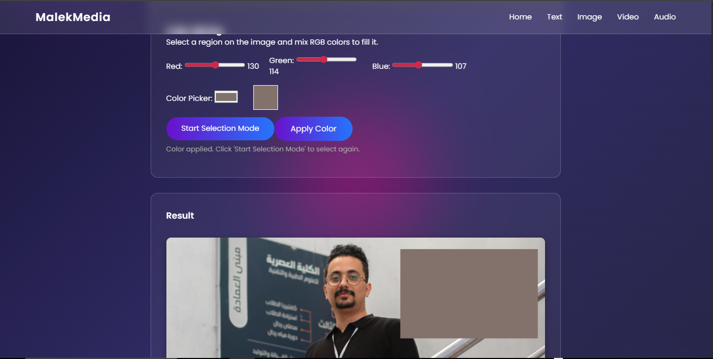

---

### 🎬 واجهة معالجة الفيديو (Video Processing)

#### رفع وعرض الفيديو
واجهة معالجة الفيديو حيث يمكن رفع ملف فيديو ومعاينته مباشرة مع إمكانية تحديد عدد الإطارات المراد استخراجها.

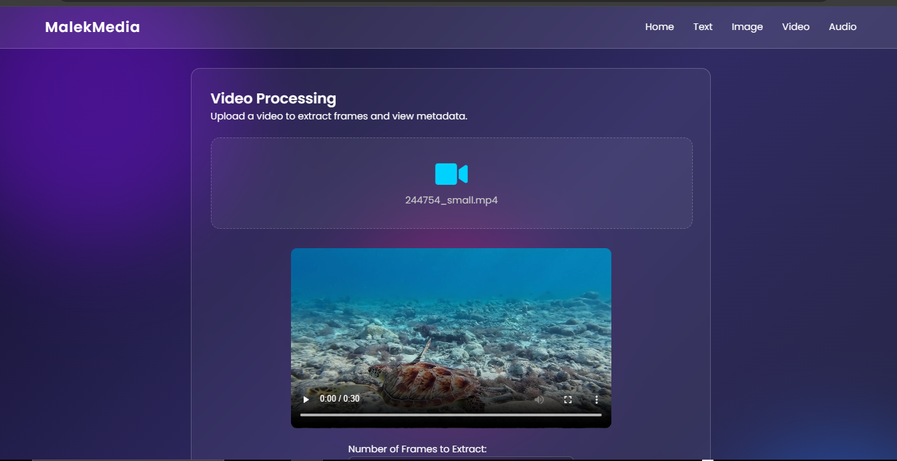

#### البيانات الوصفية والإطارات المستخرجة
عرض البيانات الوصفية للفيديو (المدة، عدد الإطارات في الثانية، الدقة) مع الإطارات المستخرجة معروضة في شبكة مع إمكانية تشغيل الرسوم المتحركة.

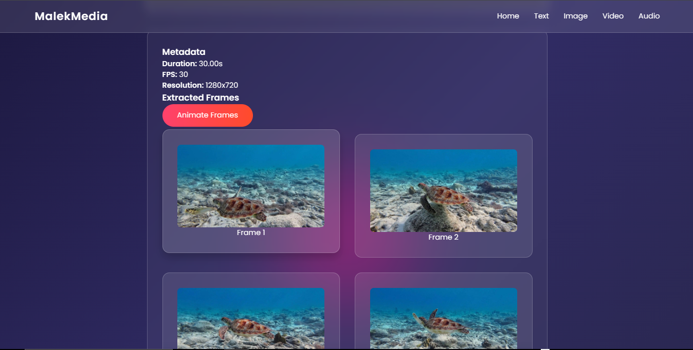

#### محاكاة الفيديو من الإطارات
ميزة "Animate Frames" التي تعيد تشغيل الإطارات المستخرجة كفيديو متحرك لمحاكاة حركة الفيديو الأصلي.

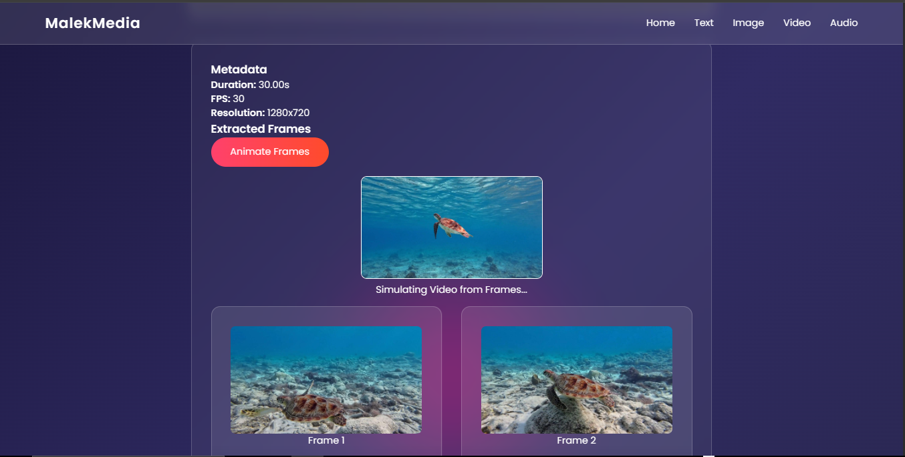

---

### 🎵 واجهة تحليل الصوت (Audio Analysis)

#### رفع وتشغيل الملف الصوتي
واجهة تحليل الصوت حيث يمكن رفع ملف صوتي وتشغيله مباشرة، مع إمكانية تحديد عدد العينات المراد تحويلها إلى تمثيل ثنائي.

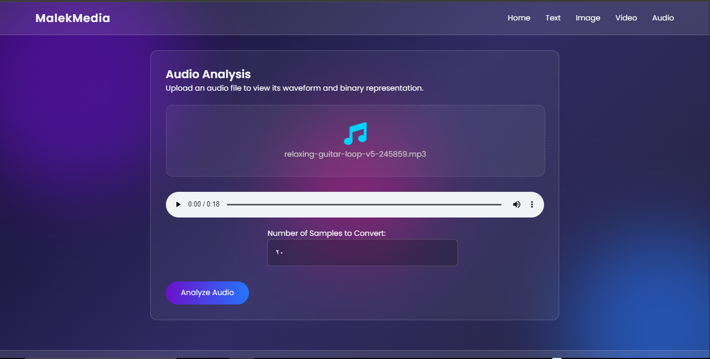

#### نتائج التحليل الصوتي
عرض البيانات الوصفية للملف الصوتي (المدة، معدل العينات، إجمالي العينات) مع رسم الموجة الصوتية (Waveform) والتمثيل الثنائي (Binary) لعينات الصوت.

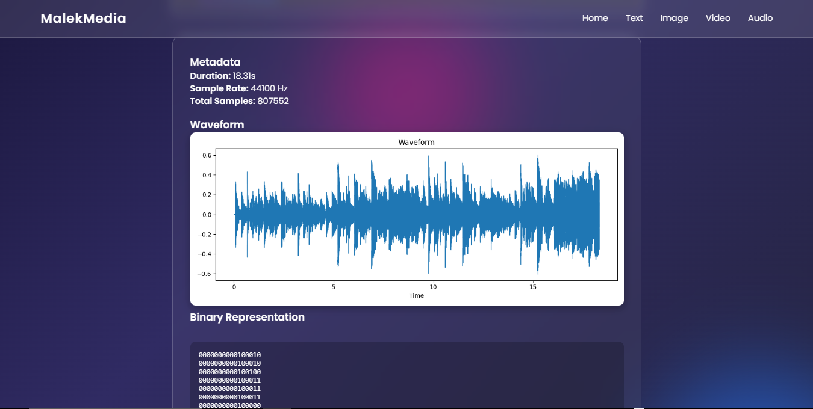
